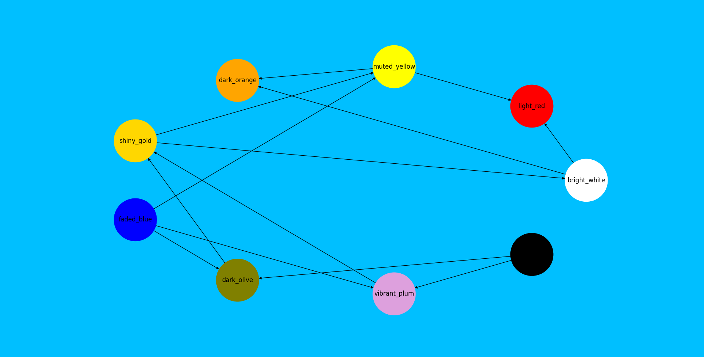
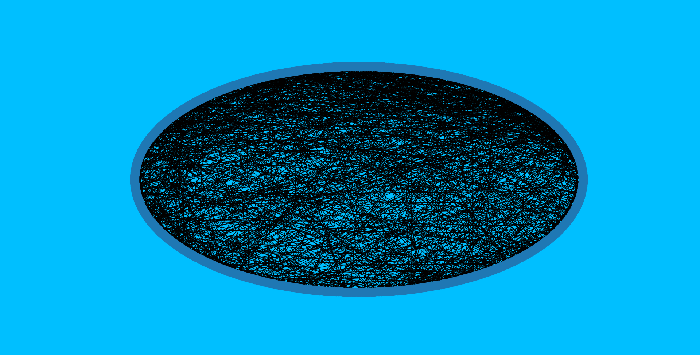

Day 7
=====

Okay this is the first one where I was completely lost on how to go about it
so I immediately went to the solutions subreddit. The reason for this was I'd
rather get a solution and figure out how it works and why it works then spend
ages coming up with a much worse solution that may not even work.

So what is the problem that caused this "aaaah no"?

Well...

.. code-block:: text

    Due to recent aviation regulations, many rules (your puzzle input) are being enforced about bags and their contents; bags must be color-coded and must contain specific quantities of other color-coded bags. Apparently, nobody responsible for these regulations considered how long they would take to enforce!

    For example, consider the following rules:

    light red bags contain 1 bright white bag, 2 muted yellow bags.
    dark orange bags contain 3 bright white bags, 4 muted yellow bags.
    bright white bags contain 1 shiny gold bag.
    muted yellow bags contain 2 shiny gold bags, 9 faded blue bags.
    shiny gold bags contain 1 dark olive bag, 2 vibrant plum bags.
    dark olive bags contain 3 faded blue bags, 4 dotted black bags.
    vibrant plum bags contain 5 faded blue bags, 6 dotted black bags.
    faded blue bags contain no other bags.
    dotted black bags contain no other bags.

    These rules specify the required contents for 9 bag types. In this example, every faded blue bag is empty, every vibrant plum bag contains 11 bags (5 faded blue and 6 dotted black), and so on.

    You have a shiny gold bag. If you wanted to carry it in at least one other bag, how many different bag colors would be valid for the outermost bag? (In other words: how many colors can, eventually, contain at least one shiny gold bag?)

    In the above rules, the following options would be available to you:

    A bright white bag, which can hold your shiny gold bag directly.
    A muted yellow bag, which can hold your shiny gold bag directly, plus some other bags.
    A dark orange bag, which can hold bright white and muted yellow bags, either of which could then hold your shiny gold bag.
    A light red bag, which can hold bright white and muted yellow bags, either of which could then hold your shiny gold bag.
    So, in this example, the number of bag colors that can eventually contain at least one shiny gold bag is 4.

Yeah doesn't that sound pretty mental?? So yeah I got scared.
Alright first things first is to create a dictionary with each bag as a key,
then the value of that key will be a list of tuples. Each tuple will contain
the amount of a child bag and what the child bag is. So for the rule:

.. code-block:: text

    light red bags contain 1 bright white bag, 2 muted yellow bags.

We will get:

.. code-block:: python

    {
        'light_red': [
            (1, 'bright_white'),
            (2, 'muted_yellow')
        ]
    }

This is gonna be pretty handy.

.. code-block:: python

    def get_rules(path):
        """Get the rules from the .dat file.

        Args:
            path (str): The path to the file to open.

        Returns:
            dict: dictionary of rules.
        """
        with open(Path(f"{path}"), "r") as read_file:
            rules_list = [line.strip().split() for line in read_file.readlines()]
        rules = {}
        for rule in rules_list:
            parent = f"{rule[0]}_{rule[1]}"
            index = 4
            contains = []
            while index < len(rule) and rule[index] != "no":
                count = int(rule[index])
                child = f"{rule[index + 1]}_{rule[index + 2]}"
                contains.append((count, child))
                index += 4
            rules[parent] = contains
        return rules

Alright now that we have the rules in a giant dictionary, lets get into the
real madness of this challenge.

Part 1
------

So part 1 requires us to get the amount of bag colors that can eventually
contain at least one shiny gold bag. I was assuming some kinda recursive
magic for this, but it turns out graphs was the solution! Or at least the
solution I liked. I actually do understand this now which I'm pretty
happy about.

The way this works is by creating a big graph with each bag colour being
a node and each edge being the connections between the bag colours.

If we visualize the graph created using the example rules we get:

Obviously the actual graph is a lot bigger, a lot bigger...

Awesome networkx has a function called predecessor so we give the function
this generated graph and the source node (shiny_gold), it then finds all
the nodes that can either contain that source node, or their children can
contain that node. We just minus 1 from it to remove the "shiny_gold" bag
itself being counted and boom!

.. code-block:: python

    def get_number_of_bags_eventually_containing(rules):
        """Get the number of bags that will eventually contain "shiny_gold".

        This is done by creating a networkx graph.

        We iterate over the rules and for each bag the rule is for we get the
        "child" bags for that rule and create an edge between the "parent" bag
        and the "child" bag. This makes sure there is a node for all the bags
        and that the bags have all the connections for that bag.

        Then we use networkx.predecessor() to find all the bags that will
        eventually have "shiny_gold" as a child. We minus from this as the
        "shiny_gold" bag itself will be included.

        Args:
            rules (dict): The rules to graph.

        Returns:
            int: The number of bags that will eventually contain "shiny_gold".
        """
        graph = nx.DiGraph()
        for parent, contains in rules.items():
            for _, child in contains:
                graph.add_edge(child, parent)

        return len(nx.predecessor(graph, "shiny_gold")) - 1

Part 2
------

So for part 2, it's now using those rules to see how many bags your bag must
contain, which is obviously a stupidly big number...

This was achieved by using a recursive function to check the given bag, see
how many bags that bag needed and then see how many bags it's bags needs.

The docstring should hopefully explain it:

.. code-block:: python

    def get_bags(rules, colour):
        """Get the number of bags that will be inside the given colour bag.

        This recursive function works by getting the count of the parent bag,
        then for each of the children bags, running this function to get their
        count and so on. One will be added to this sum to make sure the given
        bag is also counted.

        Args:
            rules (dict): The rules to iterate over.
            colour (str): The bag to check the contents of.

        Returns:
            int: The number of bags inside the given bag.
        """
        return sum([
            1,
            sum(
                count * get_bags(rules, child) for count, child in rules[colour]
            )
        ])

    bags = get_bags(rules, "shiny_gold") - 1

This was the hardest challenge so far! But I got to learn about NetworkX and
Matplotlib so that's pretty good!
